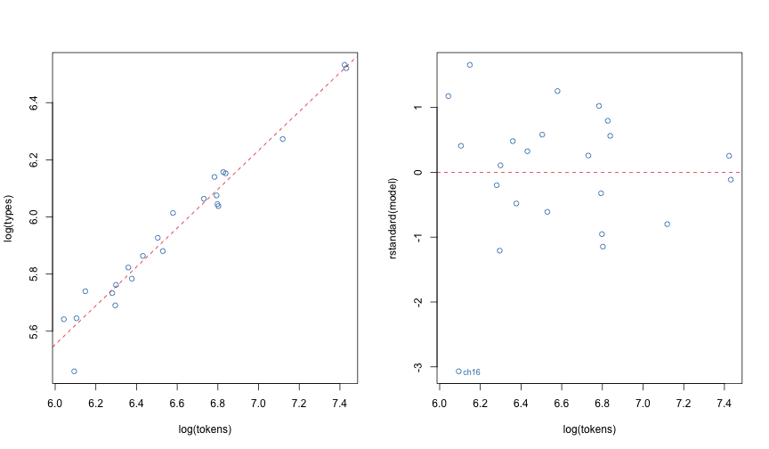
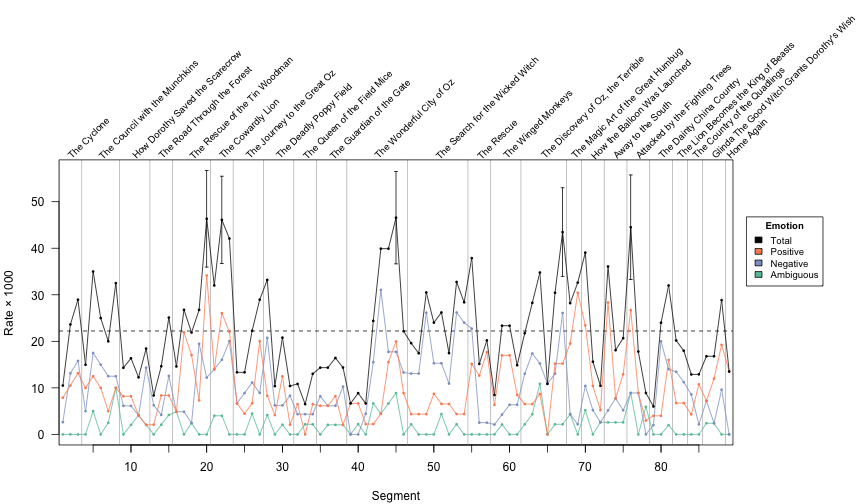

<!--
%\VignetteIndexEntry{Introduction to corpus}
%\VignetteEngine{knitr::rmarkdown}
%\VignetteEncoding{UTF-8}
-->

Introduction to corpus
======================


Overview
--------

Data preparation
----------------

For a demonstration text we will use L. Frank Baum's *The Wonderful Wizard of
Oz*, available as [Project Gutenberg EBook #55][gutenberg-oz]. We first
download the text and strip off the Project Gutenberg header and footer.


```r
url <- "http://www.gutenberg.org/cache/epub/55/pg55.txt"
raw <- readLines(url, encoding = "UTF-8")

# the text starts after the Project Gutenberg header...
start <- grep("^\\*\\*\\* START OF THIS PROJECT GUTENBERG EBOOK", raw) + 1

# ...end ends at the Project Gutenberg footer.
stop <- grep("^End of Project Gutenberg", raw) - 1

lines <- raw[start:stop]
```

The novel starts with front matter: a title page, table of contents,
introduction, and half title page. Then, a series of chapters follow.
We group the lines by section.

```r
# the front matter ends at the half title page
half_title <- grep("^THE WONDERFUL WIZARD OF OZ", lines)

# chapters start with "1.", "2.", etc...
chapter <- grep("^[[:space:]]*[[:digit:]]+\\.", lines)

# ... and appear after the half title page
chapter <- chapter[chapter > half_title]

# get the section texts (including the front matter)
start <- c(1, chapter + 1)
end <- c(chapter - 1, length(lines))
text <- mapply(function(s, e) paste(lines[s:e], collapse = "\n"), start, end)

# discard the front matter
text <- text[-1]

# get the section titles, removing the prefix ("1.", "2.", etc.)
title <- sub("^[[:space:]]*[[:digit:]]+[.][[:space:]]*", "", lines[chapter])
```


Corpus object
-------------

Now that we have obtained our raw data, we put everything together into a
corpus object, constructed via the `corpus` function:


```r
data <- corpus(title, text)
rownames(data) <- sprintf("ch%02d", seq_along(chapter))
```

The `corpus` function behaves similarly to the `data.frame` function, but
expects one of the columns to be named `"text"`. Note that we do not need
to specify `stringsAsFactors = FALSE` when creating a corpus object.
As an alternative to using the `corpus` function, we can construct a data
frame using some other method (e.g., `read.csv` or `read_ndjson`) and use
the `as_corpus` function.


A corpus object is just a data frame with a column named "text" of type
`"corpus_text"`. When using the *corpus* library, it is not strictly necessary
to use corpus objects as inputs; most functions will accept with character
vectors and ordinary data frames. Using a corpus object gives better
printing behavior and allows setting a `text_filter` attribute to override
the default text preprocessing.


The `corpus` function returns a data frame with the class attribute set to
`c("corpus_frame", "data.frame")`, to make printing nicer:


```r
emoji <- data.frame(text = sapply(0x1f600 + 1:30, intToUtf8),
                    stringsAsFactors = FALSE)
print(emoji) # as a data frame
```

```
         text
1  \U0001f601
2  \U0001f602
3  \U0001f603
4  \U0001f604
5  \U0001f605
6  \U0001f606
7  \U0001f607
8  \U0001f608
9  \U0001f609
10 \U0001f60a
11 \U0001f60b
12 \U0001f60c
13 \U0001f60d
14 \U0001f60e
15 \U0001f60f
16 \U0001f610
17 \U0001f611
18 \U0001f612
19 \U0001f613
20 \U0001f614
21 \U0001f615
22 \U0001f616
23 \U0001f617
24 \U0001f618
25 \U0001f619
26 \U0001f61a
27 \U0001f61b
28 \U0001f61c
29 \U0001f61d
30 \U0001f61e
```

```r
print(as_corpus(emoji)) # as a corpus (cuts off after 18 rows)
```

```
   text
1    😁​
2    😂​
3    😃​
4    😄​
5    😅​
6    😆​
7    😇​
8    😈​
9    😉​
10   😊​
11   😋​
12   😌​
13   😍​
14   😎​
15   😏​
16   😐​
17   😑​
18   😒​
⋮
(30 rows total)
```

```r
print(as_corpus(emoji), 5) # cuts off after 5 rows
```

```
  text
1   😁​
2   😂​
3   😃​
4   😄​
5   😅​
⋮
(30 rows total)
```


Tokenization
------------

Text in *corpus* is represented as a sequence of tokens, each taking a value
in a set of types. We can see the tokens for one or more elements using
the `text_tokens` function:


```r
text_tokens(data["ch24",]) # Chapter 24's tokens
```

```
$ch24
 [1] "aunt"     "em"       "had"      "just"     "come"     "out"      "of"       "the"     
 [9] "house"    "to"       "water"    "the"      "cabbages" "when"     "she"      "looked"  
[17] "up"       "and"      "saw"      "dorothy"  "running"  "toward"   "her"      "."       
[25] "\""       "my"       "darling"  "child"    "!"        "\""       "she"      "cried"   
[33] ","        "folding"  "the"      "little"   "girl"     "in"       "her"      "arms"    
[41] "and"      "covering" "her"      "face"     "with"     "kisses"   "."        "\""      
[49] "where"    "in"       "the"      "world"    "did"      "you"      "come"     "from"    
[57] "?"        "\""       "\""       "from"     "the"      "land"     "of"       "oz"      
[65] ","        "\""       "said"     "dorothy"  "gravely"  "."        "\""       "and"     
[73] "here"     "is"       "toto"     ","        "too"      "."        "and"      "oh"      
[81] ","        "aunt"     "em"       "!"        "i'm"      "so"       "glad"     "to"      
[89] "be"       "at"       "home"     "again"    "!"        "\""      
```

The default behavior is to normalize tokens by changing the cases of the
letters to lower case. A `text_filter` object controls the rules for
segmentation and normalization. We can inspect the text filter:

```r
text_filter(data)
```

```
Text filter with the following options:

	map_case: TRUE
	map_quote: TRUE
	remove_ignorable: TRUE
	stemmer: NULL
	stem_dropped: FALSE
	stem_except: NULL
	combine:  chr [1:146] "A." "A.D." "a.m." "A.M." "A.S." "AA." "AB." "Abs." "AD." "Adj." ...
	drop_letter: FALSE
	drop_number: FALSE
	drop_punct: FALSE
	drop_symbol: FALSE
	drop: NULL
	drop_except: NULL
	sent_crlf: FALSE
	sent_suppress:  chr [1:146] "A." "A.D." "a.m." "A.M." "A.S." "AA." "AB." "Abs." "AD." ...
```
If the text column is of type `corpus_text` as returned by `as_text`, then
we can change the text filter properties:

```r
text_filter(data)$map_case <- FALSE
text_filter(data)$drop_punct <- TRUE
text_tokens(data["ch24",])
```

```
$ch24
 [1] "Aunt"     "Em"       "had"      "just"     "come"     "out"      "of"       "the"     
 [9] "house"    "to"       "water"    "the"      "cabbages" "when"     "she"      "looked"  
[17] "up"       "and"      "saw"      "Dorothy"  "running"  "toward"   "her"      NA        
[25] NA         "My"       "darling"  "child"    NA         NA         "she"      "cried"   
[33] NA         "folding"  "the"      "little"   "girl"     "in"       "her"      "arms"    
[41] "and"      "covering" "her"      "face"     "with"     "kisses"   NA         NA        
[49] "Where"    "in"       "the"      "world"    "did"      "you"      "come"     "from"    
[57] NA         NA         NA         "From"     "the"      "Land"     "of"       "Oz"      
[65] NA         NA         "said"     "Dorothy"  "gravely"  NA         NA         "And"     
[73] "here"     "is"       "Toto"     NA         "too"      NA         "And"      "oh"      
[81] NA         "Aunt"     "Em"       NA         "I'm"      "so"       "glad"     "to"      
[89] "be"       "at"       "home"     "again"    NA         NA        
```

To restore the defaults, set the text filter to `NULL`:

```r
text_filter(data) <- NULL
```
In addition to mapping case and quotes (the defaults), I'm going to drop
punctuation.

```r
text_filter(data) <- text_filter(drop_punct = TRUE)
```

The tokenizer allows for precise controlling over token dropping and token
stemming. It also allows combining two or more words into a single token as
in the following example:

```r
text_tokens("I live in New York City, New York",
            text_filter(combine = c("new york", "new york city")))
```

```
[[1]]
[1] "i"             "live"          "in"            "new york city" ","             "new york"     
```
This example using the optional second argument to `text_tokens` to override
the first argument's default text filter.  Here, instances of "new york" and
"new york city" get replaced by single tokens, with the longest match taking
precedence. See the documentation for `text_tokens` describes the full
tokenization process.


Text statistics
---------------

The `text_ntoken`, `text_ntype`, and `text_nsentence` functions return the
numbers of tokens, unique types, and sentences, respectively, in a set of
texts. We can use these functions to get an overview of the section lengths
and lexical diversities.


```r
(stats <- text_stats(data))
```

```
     tokens types sentences
ch01   1142   414        57
ch02   2001   567       131
ch03   1955   570       122
ch04   1434   454        81
ch05   2054   524       108
ch06   1498   458        96
ch07   1798   530        91
ch08   1926   517       102
ch09   1383   466        73
ch10   1950   539       110
ch11   3608   782       190
ch12   3667   788       176
ch13   1188   404        49
ch14   1885   557       100
ch15   2760   638       188
ch16    921   316        71
ch17   1151   400        72
ch18   1162   379        87
⋮
(24 rows total)
```

[Heaps' law][heaps-law] says that the logarithm of the number of unique
types is a linear function of the number of tokens. We can test this law
formally with a regression analysis.

In this analysis, we will exclude the last chapter (Chapter 24), because it is
much shorter than the others and has a disproportionate influence on the fit.


```r
subset <- row.names(stats) != "ch24"
model <- lm(log(types) ~ log(tokens), stats, subset)
summary(model)
```

```

Call:
lm(formula = log(types) ~ log(tokens), data = stats, subset = subset)

Residuals:
      Min        1Q    Median        3Q       Max 
-0.113568 -0.031623  0.006547  0.034415  0.086886 

Coefficients:
            Estimate Std. Error t value Pr(>|t|)    
(Intercept)  1.94872    0.19082   10.21 1.34e-09 ***
log(tokens)  0.57441    0.02591   22.17 4.73e-16 ***
---
Signif. codes:  0 '***' 0.001 '**' 0.01 '*' 0.05 '.' 0.1 ' ' 1

Residual standard error: 0.04894 on 21 degrees of freedom
Multiple R-squared:  0.959,	Adjusted R-squared:  0.9571 
F-statistic: 491.6 on 1 and 21 DF,  p-value: 4.73e-16
```

We can also inspect the relation visually

```r
par(mfrow = c(1, 2))
plot(log(types) ~ log(tokens), stats, col = 2, subset = subset)
abline(model, col = 1, lty = 2)

plot(log(stats$tokens[subset]), rstandard(model), col = 2,
     xlab = "log(tokens)")
abline(h = 0, col = 1, lty = 2)

outlier <- abs(rstandard(model)) > 2
text(log(stats$tokens)[subset][outlier], rstandard(model)[outlier],
     row.names(stats)[subset][outlier], cex = 0.75, adj = c(-0.25, 0.5),
     col = 2)
```



The analysis tells us that Heap's law accurately characterizes the lexical
diversity (type-to-token ratio) for the main chapters in *The Wizard of Oz*.
The number of unique types grows roughly as the number of tokens raised to the
power `0.6`.


The one chapter with an unusually low lexical diversity is Chapter 16. This
chapter contains mostly dialogue between Oz and Dorothy's simple-minded
companions (the Scarecrow, Tin Woodman, and Lion).


Emotional affect
----------------

### Emotion lexicon

Next we will look at usage rates for emotion words from the WordNet Affect
lexicon. As a starting point, we will take the "Positive", "Negative", and
"Ambigous" emotion terms (exluding the other category, "Neutral").


```r
affect <- subset(wnaffect, emotion != "Neutral")
affect$emotion <- droplevels(affect$emotion) # drop the unused 'Neutral' level
affect$category <- droplevels(affect$category) # drop unused categories
```

Rather than blindly applying the lexicon, we first check to see what the most
common emotion terms are.

```r
counts <- term_stats(data)
subset(counts, term %in% affect$term)
```

```
    term       count support
59  down          93      22
86  great        138      20
90  good          74      20
105 like          64      19
144 heart         67      16
191 yellow        33      14
206 near          20      14
208 glad          19      14
216 afraid        29      13
248 still         20      12
254 surprise      15      12
283 happy         15      11
294 wicked        72      10
316 low           15      10
325 close         13      10
341 terrible      27       9
363 sorry         14       9
368 frightened    13       9
⋮
(168 rows total)
```

A few terms jump out as unusual: "yellow" is probably for the yellow brick
road, and "wicked" is probably for the wicked witch. When these terms appear,
they probably don't describe an emotional state. We can verify this using the
`text_locate` function, which shows these terms in context.


```r
text_locate(data, "yellow")
```

```
   text before                                    instance                                     after
1  ch02 …d to the City of Emeralds is paved with   yellow   brick," said the\nWitch, "so you cannot…
2  ch03 …ke her long to find\nthe one paved with   yellow   bricks.  Within a short time she was wa…
3  ch03 …er shoes tinkling merrily on\nthe hard,   yellow   road-bed.  The sun shone bright and the…
4  ch03 …e, and again started along the road of\n  yellow   brick.  When she had gone several miles…
5  ch03 …ce, and\nthey started along the path of   yellow   brick for the Emerald City.\n\nToto did…
6  ch04 …t the Scarecrow often stumbled over the   yellow   bricks,\nwhich were here very uneven.  …
7  ch04 …at their branches met over the\nroad of   yellow   brick.  It was almost dark under the tr…
8  ch05 …nd was about to go back to the road of\n  yellow   brick, she was startled to hear a deep …
9  ch05 …y came to the\nroad that was paved with   yellow   brick.\n\nThe Tin Woodman had asked Dor…
10 ch06 …k woods.  The road was still paved with   yellow   brick, but these\nwere much covered by …
11 ch07 … rested they started along the road of\n  yellow   brick, silently wondering, each in his …
12 ch07 …of the water they could see the road of   yellow   brick running\nthrough a beautiful coun…
13 ch08 …ther and\nfarther away from the road of   yellow   brick.  And the water grew so deep\ntha…
14 ch08 …arried them a long way past the road of   yellow   brick that led to the\nEmerald City.\n… 
15 ch08 …was carpeted with them.  There were big   yellow   and white and\nblue and purple blossoms…
16 ch08 … must hurry and get back to the road of   yellow   brick before dark,"\nhe said; and the S…
17 ch09   \n\n"We cannot be far from the road of   yellow   brick, now," remarked the\nScarecrow, a…
18 ch09 … toward them.  It was, indeed, a\ngreat   yellow   Wildcat, and the Woodman thought it mus…
⋮
(33 rows total)
```

```r
text_locate(data, "wicked")
```

```
   text before                                    instance                                     after
1  ch02 …o grateful to you for having killed the   Wicked   Witch of the\nEast, and for setting our…
2  ch02 …rceress, and saying she had\nkilled the   Wicked   Witch of the East?  Dorothy was an inno…
3  ch02 …as she?" asked Dorothy.\n\n"She was the   Wicked   Witch of the East, as I said," answered…
4  ch02 …ve in this land of the East\n where the   Wicked   Witch ruled."\n\n"Are you a Munchkin?" …
5  ch02 …e love me.  I am not as powerful as the   Wicked   Witch was who\nruled here, or I should …
6  ch02 …lf."\n\n"But I thought all witches were   wicked  ," said the girl, who was half\nfrighten…
7  ch02 … in the East and the West were, indeed,   wicked   witches;\nbut now that you have killed …
8  ch02 …ve killed one of them, there is but one   Wicked   Witch\nin all the Land of Oz--the one w…
9  ch02 …d to the\ncorner of the house where the   Wicked   Witch had been lying.\n\n"What is it?" …
10 ch02 …where the Winkies live, is ruled by the   Wicked   Witch of\nthe West, who would make you …
11 ch03 …he had been the means of destroying the   Wicked   Witch and\nsetting them free from bonda…
12 ch03 …e their freedom from the bondage of the   Wicked   Witch.\n\nDorothy ate a hearty supper a…
13 ch03 …u wear silver shoes and have killed the   Wicked   Witch.\nBesides, you have white in your…
14 ch05 …ousework.  So the old woman went to the   Wicked   Witch of the East, and\npromised her tw…
15 ch05 …ld prevent the marriage.\nThereupon the   Wicked   Witch enchanted my axe, and when I was …
16 ch05 … used to it.  But my action angered the   Wicked   Witch of the East,\nfor she had promise…
17 ch05 …I had them replaced with tin ones.\nThe   Wicked   Witch then made the axe slip and cut of…
18 ch05 … of tin.\n\n"I thought I had beaten the   Wicked   Witch then, and I worked harder than\ne…
⋮
(72 rows total)
```

We can also inspect the first token after each appearance of "wicked":

```r
term_stats(text_sub(text_locate(data, "wicked")$after, 1, 1))
```

```
  term     count support
1 witch       58      58
2 creature     2       2
3 woman        2       2
4 and          1       1
5 deeds        1       1
6 in           1       1
7 one          1       1
8 that         1       1
9 witches      1       1
```
of the 72 appearances of "wicked", 58 are followed by "witch" or "witches".
Likewise, "yellow" is often referring to the road, or referring to the color
of an object and not an emotion:

```r
term_stats(text_sub(text_locate(data, "yellow")$after, 1, 1))
```

```
   term     count support
1  brick       16      16
2  and          3       3
3  winkies      3       3
4  bricks       2       2
5  castle       2       2
6  daisies      1       1
7  flowers      1       1
8  in           1       1
9  land         1       1
10 road-bed     1       1
11 rooms        1       1
12 wildcat      1       1
```

The word "heart" is also suspiciously frequent. Here are some occurrences of
that word:

```r
text_locate(data, "heart")
```

```
   text before                                    instance                                     after
1  ch01 …uld scream\nand press her hand upon her   heart    whenever Dorothy's merry voice\nreached…
2  ch05 …:\n\n"Do you suppose Oz could give me a   heart   ?"\n\n"Why, I guess so," Dorothy answere…
3  ch05 …oodman.  "But once I had\nbrains, and a   heart    also; so, having tried them both, I sho…
4  ch05 …them both, I should much\nrather have a   heart   ."\n\n"And why is that?" asked the Scare…
5  ch05 …at I soon\ngrew to love her with all my   heart   .  She, on her part, promised to\nmarry …
6  ch05 …ell as ever.  But, alas!  I had\nnow no   heart   , so that I lost all my love for the Mun…
7  ch05 …st loss I had known was the loss of my\n  heart   .  While I was in love I was the happies…
8  ch05 …rth; but no one\ncan love who has not a   heart   , and so I am resolved to ask Oz to give…
9  ch05 …new why he was so anxious to get a\nnew   heart   .\n\n"All the same," said the Scarecrow,…
10 ch05 …, "I shall ask for brains instead of\na   heart   ; for a fool would not know what to do w…
11 ch05 …a fool would not know what to do with a   heart    if he had\none."\n\n"I shall take the h…
12 ch05 …t if he had\none."\n\n"I shall take the   heart   ," returned the Tin Woodman; "for brains…
13 ch05 …man had\nno brains and the Scarecrow no   heart   , or each got what he wanted.\n\nWhat wo…
14 ch06 ….  These\nsounds made the little girl's   heart    beat fast, for she did not know\nwhat m…
15 ch06 …appy.\nBut whenever there is danger, my   heart    begins to beat fast."\n\n"Perhaps you h…
16 ch06 …ins to beat fast."\n\n"Perhaps you have   heart    disease," said the Tin Woodman.\n\n"It …
17 ch06 …t to be glad, for it\nproves you have a   heart   .  For my part, I have no heart; so I ca…
18 ch06 …u have a heart.  For my part, I have no   heart   ; so I cannot\nhave heart disease."\n\n"…
⋮
(67 rows total)
```

A central part of the novel's plot is the Tin Woodman's quest for a heart; it
is not surprising that the word "heart" shows up so frequently. Indeed, most
appearances of the word "heart" are within 25 tokens of "woodman":


```r
loc <- text_locate(data, "heart")
before <- text_detect(text_sub(loc$before, -25, -1), "woodman")
after <- text_detect(text_sub(loc$after, 1, 25), "woodman")
summary(before | after)
```

```
   Mode   FALSE    TRUE 
logical      22      45 
```
"Woodman" appears within 25 tokens of "heart" in in 45 of the 67
contexts where the latter word appears.


All of this analysis shows that we should probably exclude these terms if we
are interested in words that connote emotion in _The Wizard of Oz_:


```r
affect <- subset(affect, !term %in% c("heart", "wicked", "yellow"))
```

### Counting emotion words


```r
term_scores <- with(affect, unclass(table(term, emotion)))
term_scores <- term_scores / rowSums(term_scores)

chunks <- text_split(data, "tokens", 500)
n <- text_ntoken(chunks)
x <- term_matrix(chunks, select = rownames(term_scores))
text_scores <- x %*% term_scores

# compute the rates per 1000 tokens
unit <- 1000
rate <- list(pos = text_scores[, "Positive"] / n * unit,
             neg = text_scores[, "Negative"] / n * unit,
             ambig = text_scores[, "Ambiguous"] / n * unit)
rate$total <- rate$pos + rate$neg + rate$ambig

# compute the standard errors
se <- lapply(rate, function(r) sqrt(r * (unit - r) / n))

# set up segment IDs
i <- seq_len(nrow(chunks))

# set the plot margins, with extra space below the plot
par(mar = c(4, 4, 8, 6) + 0.1, las = 1)

# set up the plot coordinates; put labels but no axes
xlim <- range(i - 0.5, i + 0.5)
ylim <- range(0, rate$total + se$total, rate$total - se$total)
plot(xlim, ylim, type = "n", xlab = "Segment", ylab = "Rate \u00d7 1000", axes = FALSE,
     xaxs = "i")
usr <- par("usr") # get the user coordinates for later

# put tick marks at multiples of 5 on the x axis; labels at multiples of 10
axis(1, at = i[i %% 5 == 0], labels = FALSE)
axis(1, at = i[i %% 10 == 0], labels = TRUE)

# defaults for the y axis
axis(2)

# label x axis with chapter titles
labels <- data$title
at <- tapply(i, chunks$parent, min) - 0.5

# (adapted from https://www.r-bloggers.com/rotated-axis-labels-in-r-plots/)
text(at, usr[4] + 0.01 * diff(usr[3:4]),
     labels = labels, adj = 0, srt = 45, cex = 0.6, xpd = TRUE)

# put vertical lines at chapter boundaries
abline(v = at, col = "gray")

# frame the plot
box()

# colors for the different emotions, from RColorBrewer::brewer.pal(3, "Set2")
col <- c(total = "#000000", pos = "#FC8D62", neg = "#8DA0CB", ambig = "#66C2A5")

# add a legend on the right hand side
legend(usr[2] + 0.01 * diff(usr[1:2]), usr[3] + 0.8 * diff(usr[3:4]),
       legend = c("Total", "Positive", "Negative", "Ambiguous"),
       title = expression(bold("Emotion")),
       fill = col[c("total", "pos", "neg", "ambig")],
       cex = 0.8, xpd = TRUE)

# for the total rate, put a dashed line at the mean rate
abline(h = mean(rate$total), lty = 2, col = col[["total"]])

# plot each rate type
for (t in c("ambig", "neg", "pos", "total")) {
    r <- rate[[t]]
    s <- se[[t]]
    cl <- col[[t]]

    # add lines and points
    lines(i, r, col = cl)
    points(i, r, col = cl, pch = 16, cex = 0.5)

    # for the total, put standard errors around interesting points
    if (t == "total") {
        # "interesting" defined as rate >2 sd away from mean
        int <- abs((r - mean(r)) / sd(r)) > 2

        segments(i[int], (r - s)[int], i[int], (r + s)[int], col = cl)
        segments((i - .2)[int], (r - s)[int], (i + .2)[int], (r - s)[int], col = cl)
        segments((i - .2)[int], (r + s)[int], (i + .2)[int], (r + s)[int], col = cl)
    }
}
```



There are two segments with particularly high emotion: segment 45 from "The
Wonderful City of Oz", where the Tin Woodman and the Cowardly Lion ask the
Wizard for help, and he compels them to defeat the Wicked Witch of the West;
and segment 64, from "The Discovery of Oz, the Terrible", where Dorothy and
her companions discover that the Wizard of Oz is just a common man.

[gutenberg-oz]: http://www.gutenberg.org/ebooks/55 "The Wonderful Wizard of Oz"
[heaps-law]: https://en.wikipedia.org/wiki/Heaps%27_law "Heap's law"
