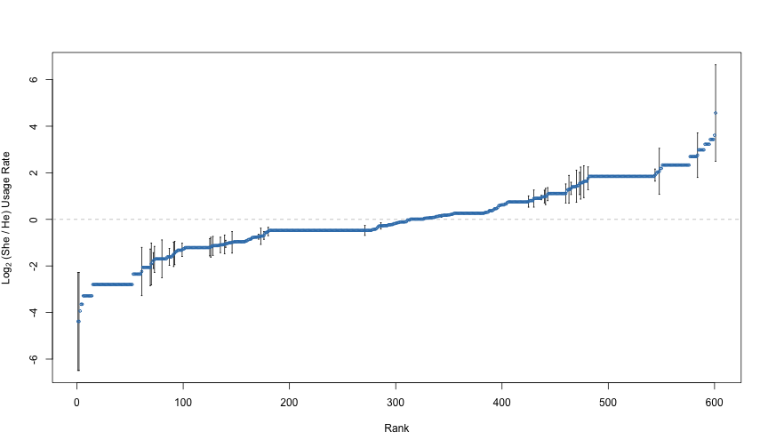
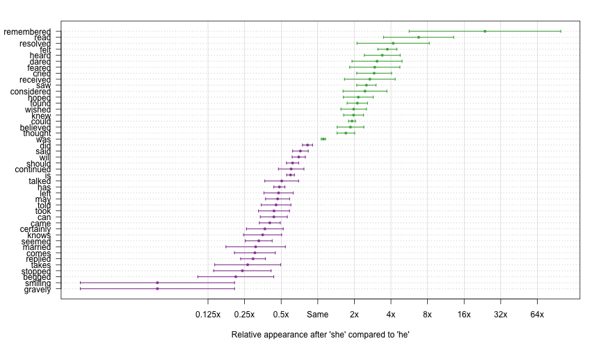

<!--
%\VignetteIndexEntry{Finding gendered words}
%\VignetteEngine{knitr::rmarkdown}
%\VignetteEncoding{UTF-8}
-->

Finding gendered words
======================


Overview
--------

In this vignette, we will look for gender-associated words  We will do this
by looking for words that follow the pronoun "she" more often than "he", or
vice-versa. The vignette is based on Julia Silge's blog post,
["Gender roles with text mining and n-grams"][silge-roles].


We will use the *corpus* package, but not rely on any other external
dependencies. The set-up is as follows.


```r
library("corpus")

# colors from RColorBrewer::brewer.pal(6, "Set1")
palette(c("#E41A1C", "#377EB8", "#4DAF4A", "#984EA3", "#FF7F00", "#FFFF33"))

# ensure consistent runs
set.seed(0) 
```

Gender bigrams in Austen's novels
---------------------------------

We will be studying gender in the context of Jane Austen's completed novels,
downloaded from [Project Gutenberg][gutenberg].


```r
# Gutenberg IDs gotten from gutenbergr::gutenberg_works(author == "Austen, Jane")
(austen <- gutenberg_corpus(c(161, 1342, 141, 158, 121, 105)))
```

```
Determining mirror for Project Gutenberg from https://www.gutenberg.org/MIRRORS.ALL
```

```
Using mirror http://eremita.di.uminho.pt/gutenberg/
```

```
Converting text from declared encoding "ISO-8859-1" to UTF-8
```

```
  title                 author      language text                                                   
1 Sense and Sensibility Jane Austen English  SENSE AND SENSIBILITY\n\nby Jane Austen\n\n(1811)\n\n… 
2 Pride and Prejudice   Jane Austen English  PRIDE AND PREJUDICE\n\nBy Jane Austen\n\n\n\nChapter 1…
3 Mansfield Park        Jane Austen English  MANSFIELD PARK\n\n(1814)\n\n\nBy Jane Austen\n\n\n\n\n…
4 Emma                  Jane Austen English  EMMA\n\nBy Jane Austen\n\n\n\n\nVOLUME I\n\n\n\nCHAPTE…
5 Northanger Abbey      Jane Austen English  NORTHANGER ABBEY\n\n\nby\n\nJane Austen (1803)\n\n\n\n…
6 Persuasion            Jane Austen English  Persuasion\n\n\nby\n\nJane Austen\n\n(1818)\n\n\n\n\nC…
```

For tokens, we will be using the lower-cased non-punctuation words

```r
text_filter(austen)$drop_punct <- TRUE
```

Specifically, we will look at the bigrams from these novels where the first
type is a pronoun.


```r
pronouns <- c("he", "she")
bigram_counts <- term_stats(austen, ngrams = 2, types = TRUE,
                            subset = type1 %in% pronouns)
print(bigram_counts)
```

```
   term      type1 type2  count support
1  she had   she   had     1472       6
2  she was   she   was     1377       6
3  he had    he    had     1023       6
4  he was    he    was      889       6
5  she could she   could    817       6
6  he is     he    is       398       6
7  she would she   would    381       6
8  she is    she   is       327       6
9  he could  he    could    307       6
10 he would  he    would    263       6
11 she did   she   did      225       6
12 he has    he    has      219       6
13 he did    he    did      191       6
14 she felt  she   felt     189       6
15 she must  she   must     184       6
16 she might she   might    173       6
17 he should he    should   158       6
18 she has   she   has      148       6
19 he must   he    must     142       6
20 he might  he    might    137       6
⋮  (1448 rows total)
```

Above, we can see the most common bigrams with gendered pronouns as their first
types.


Next, we rearrange the data  into tabular form, with one row for each term and
one column for each pronoun:


```r
terms <-  with(bigram_counts,
               tapply(count, list(type2, type1), identity, default = 0))
head(terms)
```

```
        he she
_did_    4   1
_had     1   0
_had_    2   4
_is_     0   1
_may_    1   0
_meant_  0   1
```

It looks like some terms get emphasized in the text by underscores. We can
investigate some of these:


```r
# inspect a random sample of the occurrences
text_locate(austen, c("_did_", "_had", "_meant_"), random = TRUE)
```

```
   text                  before                   instance                   after                  
13 3    … surprise to herself. And the\nnext day   _did_    bring a surprise to her. Henry had said…
4  2    …t home,” cried Elizabeth; “perhaps she\n _meant_   well, but, under such a misfortune as t…
5  2    …h had been brought on by himself. If he    _had    another_\nmotive, I am sure it would ne…
7  2    …you would never come back again. People   _did_    say\nyou meant to quit the place entire…
10 3    …ugh he\nis Henry, for a time.”\n\nJulia   _did_    suffer, however, though Mrs. Grant disc…
2  2    …dmired her--indeed I rather believe he\n  _did_   --I heard something about it--but I hard…
8  2    …d\nhumour encouraged, yet, whenever she   _did_    speak, she must be vulgar.\nNor was her…
11 3    …e the others prepared to begin.\n\nThey   _did_    begin; and being too much engaged in th…
14 4    …a,\nin her own mind, determined that he   _did_    know what he was talking\nabout, and th…
6  2    …om the\nfirst, you may remember.”\n\n“I   _did_    hear, too, that there was a time, when …
1  2    …danced with her twice. To be\nsure that   _did_    seem as if he admired her--indeed I rat…
12 3    …he found, from Edmund’s manner, that he   _did_    mean to\ngo with her. He too was taking…
3  2    …ally evident whenever they met, that he   _did_    admire her and\nto _her_ it was equally…
9  3    …r be\nheard of beyond themselves. Julia   _did_    seem inclined to admit that\nMaria’s si…
```

Let's clean the terms by removing underscores, and recompute the counts:


```r
terms <-  with(bigram_counts,
               tapply(count, list(gsub("_", "", type2), type1),
                      sum, default = 0))
head(terms)
```

```
           he she
a           4   6
able        0   1
abominates  1   0
absented    0   1
absolutely  3   1
abstained   0   1
```

Here, we changed the aggregation function from `identity()` to `sum()` to sum
the counts over all types that are equal after removing underscores.


Gender-specific usage rates
---------------------------

We want to find terms that are associated with particular gendered pronouns.
As an example, take term "loves": 


```r
term <- "loves"
i <- match(term, rownames(terms))
tab <- cbind(terms[i,], colSums(terms[-i,]))
colnames(tab) <- c(term, paste0("\u00ac", term))
print(tab)
```

```
    loves ¬loves
he      5   6988
she     7   9875
```

When the first type in a bigram is "he", it is followed by "loves" in 5
instances and another type in 6988 instances. Here are the relative rates of
"loves", conditional on the first type in the bigram:


```r
(rates <- tab[,"loves"] / rowSums(tab))
```

```
          he          she 
0.0007150007 0.0007083586 
```

The ratio of these rates is very close to one:


```r
rates[["she"]] / rates[["he"]]
```

```
[1] 0.9907104
```

The log (base-2) ratio of the rates is close to zero:

```r
log2(rates[["she"]]) - log2(rates[["he"]])
```

```
[1] -0.01346472
```

This log ratio is a good measure of the strength of association. When the
value is close to zero, there is no meaningful association. For large absolute
log ratios, we would say that there is a meaningful difference in usage
between the genders.

We compute the log ratios for all types. To avoid dividing by zero, and to
smooth the estimates when the counts are small, we add 0.5 to the count when
estimating the rate.

Some terms only appear once in the corpus. The rate estimates for these terms
will be unreliable, so we discard them.


```r
tot <- colSums(terms)
common_terms <- terms[rowSums(terms) > 1,]
he  <- (common_terms[,"he"] + 0.5) / (tot[["he"]] + 1)
she <- ((common_terms[,"she"] + 0.5) / (tot[["she"]] + 1))
log2_ratio <- log2(she) - log2(he)
```

Here are a histogram and normal probability plot of the estimates for the
remaining terms.


```r
par(mfrow = c(1, 2))
hist(log2_ratio, breaks = "Scott", col = 2, border = "white")
qqnorm(log2_ratio, col = 2)
qqline(log2_ratio, col = 1, lty = 2)
```


This doesn't quite look like a normal, but the distribution is symmetric, and
the tails are about as heavy as those of a normal. So, the z-score will be a
reasonable measure of how typical or unusual each log rate is.


```r
z <- (log2_ratio - mean(log2_ratio)) / sd(log2_ratio)
```

Here are the words more than two standard deviations away from the mean log
ratio:


```r
sort(log2_ratio[abs(z) > 2])
```

```
   gravely   believes      bowed    intends       next         or      quite     sought      won't 
 -3.958263  -3.306186  -3.306186  -3.306186  -3.306186  -3.306186  -3.306186  -3.306186  -3.306186 
    beheld        lay      looks    refused    checked    dreaded    eagerly     seized    hurried 
  3.201608   3.201608   3.201608   3.201608   3.408059   3.408059   3.408059   3.408059   3.588632 
remembered 
  4.545563 
```

The terms "remembered", "hurried", and "seized" have more "she" usages; the
terms "gravely", "believes", and "bowed" have more "he" usages.


Uncertainty quantification
--------------------------

It's hard to know which of these differences are meaningful without
quantifying the error associated with the estimates. Some words are common,
and we have reliable estimates of the log ratios. Other words are rare, and
the estimates are based on a small number of occurrences. In the rare case,
the estimates of the log ratios will be unreliable.


We need standard errors of our estimates. We can get these by starting with
the proportion estimates `he` and `she`, and then applying the
[delta method][delta-method].


The `he` and `she` rates are proportions. We get their standard errors by
using the usual formula for the standard error of a proportion, based on
the Binomial variance formula:


```r
he_se <- sqrt(he * (1 - he) / tot[["he"]])
she_se <- sqrt(he * (1 - he) / tot[["he"]])
```

To find the standard errors for the logarithms of these quantities, we use the
delta method. We multiply the standard error by the absolute value of the 
derivative of the logarithm function evaluated at the estimate:


```r
log2_he_se <- abs(1 / (log(2) * he)) * he_se
log2_she_se <- abs(1 / (log(2) * she)) * she_se
```

These formulas follow from using a Taylor expansion of `log2` around the
estimate, using that the derivative of `log2(x)` is `1 / (log(2) * x)`.


Finally, for the standard error of `log2_ratio`, we assume that the `log2_he`
and `log2_she` estimates are approximately independent, so that the variance
of their difference is the sum of their variances. This gives a formula for
the standard error of the log ratio:


```r
log2_ratio_se <- sqrt(log2_she_se^2 + log2_he_se^2)
```

Here are all of the estimated log ratios, along, with error bars for those
that are statistically significantly different from zero.


```r
# put the estimates in increasing order
r <- rank(log2_ratio, ties.method = "first")

# find the statistically significant cases
signif <- (abs(log2_ratio) / log2_ratio_se > 2)
i <- signif

# set up the plot
xlim <- xlim <- range(r)
ylim <- range(log2_ratio,
              (log2_ratio - log2_ratio_se)[i],
              (log2_ratio + log2_ratio_se)[i])
plot(xlim, ylim, type = "n", xlab = "Rank",
     ylab = expression(paste(Log[2], " (She / He) Usage Rate")))

# horizontal line at zero
abline(h = 0, col = "gray", lty = 2)

# standard error around interesting points
segments(r[i], (log2_ratio - log2_ratio_se)[i],
         r[i], (log2_ratio + log2_ratio_se)[i])
segments((r - 0.4)[i], (log2_ratio - log2_ratio_se)[i],
         (r + 0.4)[i], (log2_ratio - log2_ratio_se)[i])
segments((r - 0.4)[i], (log2_ratio + log2_ratio_se)[i],
         (r + 0.4)[i], (log2_ratio + log2_ratio_se)[i])

# points at the estimates
points(r, log2_ratio, col = 2, cex = 0.5)
```



Notice that many of the more extreme estimates are not statistically
significant. One word with a large estimate not deemed statistically
significant is the word "stopped". Here are the counts for that word, along
with the log ratio estimate and standard error:


```r
print(terms["stopped",])
```

```
 he she 
 13   4 
```

```r
print(log2_ratio[["stopped"]])
```

```
[1] -2.083794
```

```r
print(log2_ratio_se[["stopped"]])
```

```
[1] 1.708688
```

This is a word with a large imbalance, but only in a relatively small number
of samples. Due to the lack of data for the word "instantly", we deem this
imbalance to not be statistically significant. Compare this to the word
"felt":


```r
print(terms["felt",])
```

```
 he she 
 36 189 
```

```r
print(log2_ratio[["felt"]])
```

```
[1] 1.877398
```

```r
print(log2_ratio_se[["felt"]])
```

```
[1] 0.2468545
```

This has an effect size estimate on the same order as "stopped", but the
estimate is much more reliable given the larger number of appearances of the
word "felt". We judge "felt" both to have a practically significant difference
*and* a statistically significant difference.


The word "was" exhibits one other extreme:


```r
print(terms["was",])
```

```
  he  she 
 891 1378 
```

```r
print(log2_ratio[["was"]])
```

```
[1] 0.1299613
```

```r
print(log2_ratio_se[["was"]])
```

```
[1] 0.06114624
```

This word has only a minor difference between "he" and "she", but it shows up
often enough for us to get a reliable estimate of the difference. The word
"was" has a statistically significant difference between the genders, but
probably not a practically significant difference.


In the context of our application, a word is practically significance if the
absolute value of its estimate is large. This difference is statistically
significant if the estimate is large relative to its standard error. If we
only care about Austen's writing in these six novels, we may not care about
statistical significance. If, however, we want to make a statement about
Austen's writing style in general, then we want to generalize beyond our data
set, and we should only do so for words we can get reliable estimates for.


Results
-------

Here are the estimates for the words with statistically significant gender
imbalances.


```r
# order by log ratio, then name
o <- order(log2_ratio, names(log2_ratio))
est <- log2_ratio[o]
se <- log2_ratio_se[o]

# only keep significant cases
signif <- (abs(est) / se > 2)
est <- est[signif]
se <- se[signif]

# get the terms
term <- names(est)
i <- seq_along(term)

# set up the plot
par(mar = c(5, 6, 2, 2) + 0.1)
xlim <- range(est - se, est + se)
ylim <- range(i)
plot(xlim, ylim, type = "n",
     xlab = "Relative appearance after 'she' compared to 'he'",
     ylab = "", axes = FALSE)

# x-axis
ticks <- seq(-3, 6)
labels = paste0(2 ^ ticks, "x")
labels[ticks == 0] <- "Same"
axis(1, at = ticks, labels = labels)
abline(v = ticks, col = "gray", lwd = 0.5)

# y-axis, with term labels
axis(2, at = i, labels = term, las = 1)
abline(h = i, lty = 3, col = "gray")

# frame the plot
box()

# standard errors
col <- ifelse(est > 0, 3, 4)
segments(est - se, i, est + se, i, lwd = 1.5, col = col)
segments(est - se, i - 0.2, est - se, i + 0.2, lwd = 1.5, col = col)
segments(est + se, i - 0.2, est + se, i + 0.2, lwd = 1.5, col = col)

# estimates
points(est, i, pch = 16, cex = 0.75, col = col)
```



Not all of these are practically significant. Words like "should", "will", and
"was" show up because they are common, and it is possible to get precise
estimates of their gender imbalances. Still, we can see many examples of words
that have both statistically and practically meaningful gender imbalances,
especially "she"-slanted words like "remembered", "read", "longed", and
"felt". I suspect that many of these words have gender imbalances simply
because the protagonists are female. The novels give us insights into the
protagonists' emotional states, but not into those of the supporting
characters. It would be nice if we could get more balanced comparison by
adjusting for the genders of the protagonists. Until we do that, it's hard to
know if there's anything meaningful in these differences.


[delta-method]: https://en.wikipedia.org/wiki/Delta_method
[gutenberg]: https://www.gutenberg.org/ "Project Gutenberg"
[silge-roles]: https://juliasilge.com/blog/gender-pronouns/ "Gender roles with text mining and n-grams"
